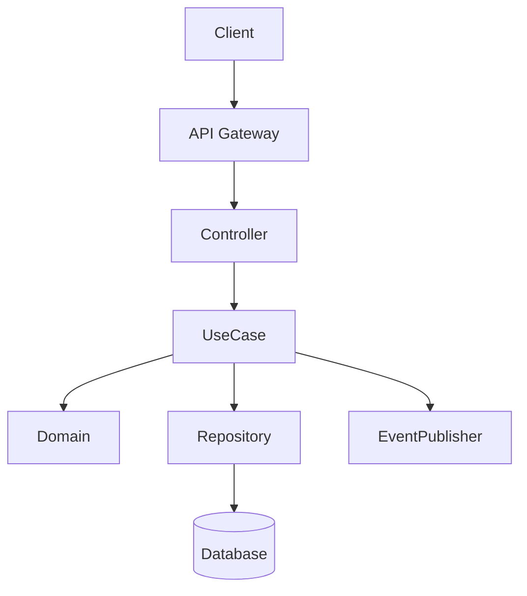
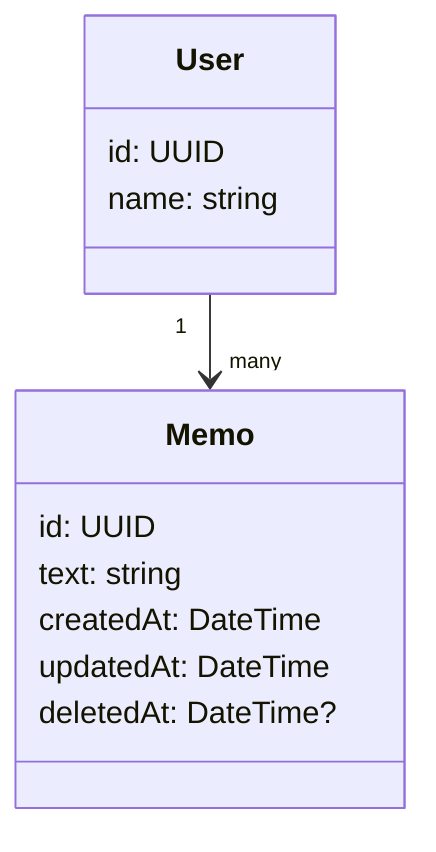
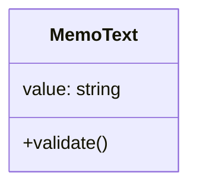
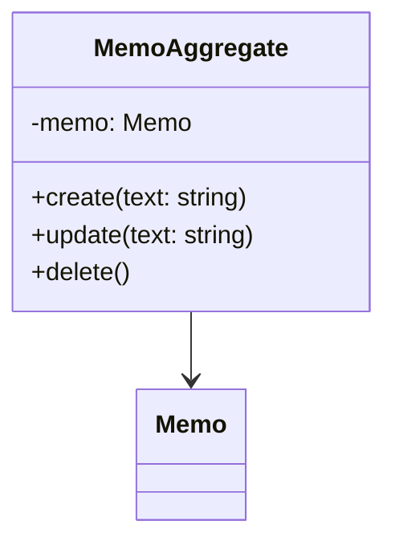
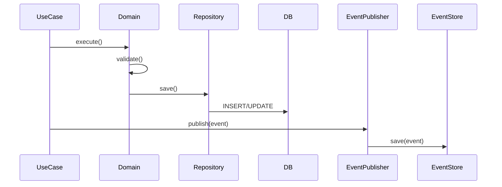
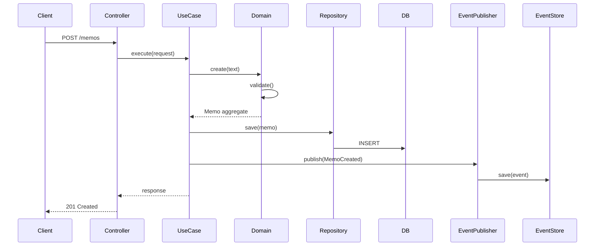
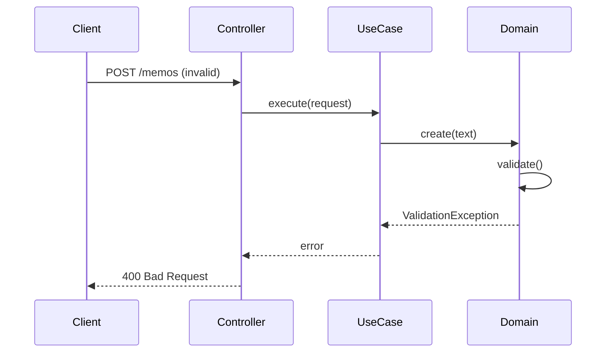
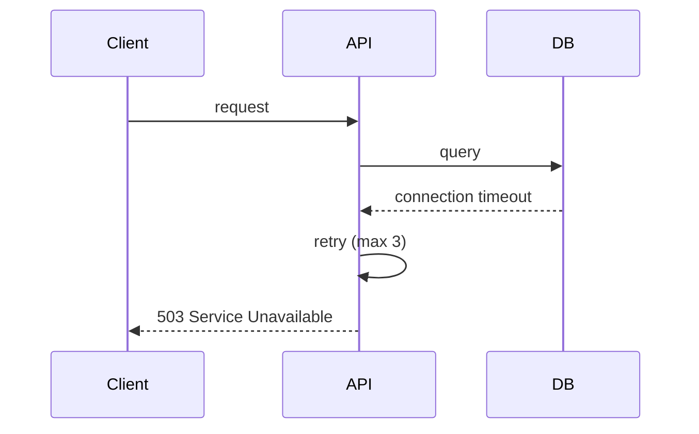

# 設計書：Simple Memo System（学習用・上級版）

**対象:** 設計初心者向け実務レベル設計書  
**目的:** DDD、クリーンアーキテクチャ、API設計の実践的学習

---

## 目次

1. [システム概要](#1-システム概要)
2. [全体アーキテクチャ](#2-全体アーキテクチャ)
3. [ドメイン設計](#3-ドメイン設計ddd)
4. [ユースケース](#4-ユースケース)
5. [API設計](#5-api設計)
   - [5.1 メモ一覧取得](#51-メモ一覧取得)
   - [5.2 メモ作成](#52-メモ作成)
   - [5.3 メモ更新](#53-メモ更新)
   - [5.4 メモ削除](#54-メモ削除)
   - [5.5 エラーレスポンス](#55-エラーレスポンス)
   - [5.6 認証・認可設計](#56-認証認可設計)
6. [イベント設計](#6-イベント設計)
7. [DB設計](#7-db設計)
8. [シーケンス図](#8-シーケンス図)
9. [非機能設計](#9-非機能設計)
   - [9.1 パフォーマンス](#91-パフォーマンス)
   - [9.2 セキュリティ](#92-セキュリティ)
   - [9.3 可用性](#93-可用性)
   - [9.4 ログ・監視設計](#94-ログ監視設計)
10. [障害設計](#10-障害設計)
11. [排他制御](#11-排他制御)
12. [テスト観点](#12-テスト観点)
13. [ディレクトリ構成](#13-ディレクトリ構成)
14. [学習ポイント](#14-学習ポイント)

---

## 1. システム概要

### 1.1 目的

本システムは、メモ管理機能を題材に以下の設計スキルを習得することを目的とする。

- CRUD設計
- API設計
- ドメイン駆動設計（DDD）
- クリーンアーキテクチャ
- イベント駆動設計（基礎）
- 非機能設計（障害・監視）

### 1.2 スコープ

- ユーザー単位でのメモ管理
- 認証付きAPI
- メモの作成・更新・削除・検索

### 1.3 前提条件

- 単一リージョン
- 小規模（学習用途）
- RDB（PostgreSQL等）使用---

## 2. 全体アーキテクチャ



### 2.1 アーキテクチャの層構造

このシステムは**クリーンアーキテクチャ**を採用し、5つの層に分かれています：

```
┌─────────────────────────────────────┐
│  Presentation Layer (Interface)     │  ← API呼び出し受け取り
│  (Controller)                       │
├─────────────────────────────────────┤
│  Application Layer (UseCase)        │  ← ビジネスロジックのオーケストレーション
├─────────────────────────────────────┤
│  Domain Layer                       │  ← ドメインロジック・ルール
├─────────────────────────────────────┤
│  Infrastructure Layer               │  ← DB、外部サービス接続
│  (Repository, EventPublisher)       │
└─────────────────────────────────────┘
```

### 2.2 各レイヤーの責務

#### **Client（クライアント）**
- **役割:** APIの呼び出し元
- **例:** フロントエンド、モバイルアプリ、外部システム
- **責務:** HTTP リクエストを送信

#### **API Gateway**
- **役割:** クライアントと内部システムの境界
- **責務:**
  - リクエストのルーティング
  - レート制限
  - CORS処理
  - ログ記録
  - リクエスト/レスポンスの変換

#### **Controller（Presentation Layer）**
- **役割:** HTTPリクエスト/レスポンスのハンドラー
- **責務:**
  - リクエストの受け取り
  - **Validator** による入力検証（専用クラスに分離）
  - ユースケースの呼び出し
  - **Mapper** による エンティティ→DTO 変換（APIレスポンス形式を一元管理）
  - ステータスコードの決定
  - ドメインエラーは `next(err)` でグローバルエラーハンドラーへ委譲

- **関連クラス:**
  - `MemoValidator` — 入力検証（`src/interface/validators/`）
  - `MemoMapper` — エンティティ→DTO変換（`src/interface/mappers/`）
  - `MemoResponse` / `MemoListResponse` — レスポンスDTO（`src/interface/dto/`）
  - `Pagination` — ページネーション値オブジェクト（`src/domain/value_objects/`）

#### **UseCase（Application Layer）**
- **役割:** ビジネスプロセスのオーケストレーション
- **責務:**
  - 入力値の詳細なバリデーション
  - ビジネスロジック実行の流れ制御
  - ドメインオブジェクトの操作
  - トランザクション管理
  - イベント発行の指示
- **例：**
  ```typescript
  // create_memo_usecase.ts
  async execute(request: CreateMemoRequest): Promise<Memo> {
    // 1. バリデーション
    validate(request);
    
    // 2. ドメイン操作
    const memo = MemoAggregate.create(request.text);
    
    // 3. 永続化
    await this.repository.save(memo);
    
    // 4. イベント発行
    await this.eventPublisher.publish(new MemoCreatedEvent(memo));
    
    return memo;
  }
  ```

#### **Domain（Domain Layer）**
- **役割:** ビジネスルールの実装
- **構成要素:**
  - **エンティティ:** `Memo`（ID、テキスト、日時を持つオブジェクト）
  - **値オブジェクト:** `MemoText`（不変な値オブジェクト）
  - **集約:** `MemoAggregate`（エンティティと値オブジェクトをまとめた単位）
  - **リポジトリインターフェース:** データアクセスの抽象化
- **責務:**
  - ビジネスルールの表現
  - オブジェクトの整合性保証
  - ドメインロジックの実装
- **例：**
  ```typescript
  // memo.ts (Entity)
  export class Memo {
    constructor(
      public id: UUID,
      public text: MemoText,
      public createdAt: DateTime
    ) {
      // ビジネスルールをここで保証
      if (!text || text.length === 0) {
        throw new InvalidMemoTextError();
      }
    }
  }
  ```

#### **Repository（Infrastructure Layer）**
- **役割:** データの永続化を担当
- **責務:**
  - データベースへの読み書き
  - ドメインオブジェクトへの変換
  - クエリの実行
- **重要:** リポジトリはドメイン層で定義されたインターフェースを実装
- **例：**
  ```typescript
  // memo_repository_impl.ts
  export class MemoRepositoryImpl implements MemoRepository {
    async save(memo: Memo): Promise<void> {
      await this.db.query(
        'INSERT INTO memos (id, user_id, text, created_at) VALUES (?, ?, ?, ?)',
        [memo.id, memo.userId, memo.text.value, memo.createdAt]
      );
    }
  }
  ```

#### **Database（Database Layer）**
- **役割:** データの物理的な永続化
- **責務:**
  - データの保存
  - インデックス管理
  - トランザクション制御

#### **EventPublisher（Infrastructure Layer）**
- **役割:** ドメインイベントの公開
- **責務:**
  - イベントのキャプチャ
  - イベントストアへの保存
  - 他のシステムへの通知
- **例：**
  ```typescript
  // event_publisher.ts
  async publish(event: DomainEvent): Promise<void> {
    // イベントストアに保存
    await this.eventStore.save(event);
    
    // 非同期処理をトリガー（メール送信など）
    this.eventBus.emit(event);
  }
  ```

### 2.3 層間の依存性ルール

```
上位層 → 下位層 へのみ依存を許す
（下位層は上位層に依存しない）

Controller → UseCase
UseCase → Domain, Repository
Domain → （他のレイヤーに依存しない）
Repository → Database
```

**メリット:**
- ドメイン層が独立（テスト容易）
- 外部フレームワークへの依存が少ない
- レイヤーの置き換え容易

### 2.4 データフロー例

**メモ作成の流れ:**

```
1. Client: POST /memos { text: "..." }
   ↓
2. API Gateway: リクエスト検証、ルーティング
   ↓
3. Controller: HTTPリクエストを受け取る
   ↓
4. UseCase: 
   - バリデーション実行
   - Domain.create() 呼び出し
   - Repository.save() で永続化
   - EventPublisher.publish() でイベント発行
   ↓
5. Domain: ビジネスルール検証
   ↓
6. Repository: SQL INSERT 実行
   ↓
7. Database: データ保存
   ↓
8. EventPublisher: イベント保存
   ↓
9. Controller: レスポンス構築
   ↓
10. API Gateway: レスポンス返却
   ↓
11. Client: 201 Created 受け取り
```

---

## 3. ドメイン設計（DDD）

### 3.1 エンティティ



### 3.2 値オブジェクト



### 3.3 集約



---

## 4. ユースケース

| ID   | 名称           | 説明           |
|------|----------------|----------------|
| UC01 | メモ作成       | メモの新規登録 |
| UC02 | メモ一覧取得   | ページング対応 |
| UC03 | メモ更新       | 内容の更新     |
| UC04 | メモ削除       | 論理削除実装   |

---

## 5. API設計

### 5.1 メモ一覧取得

```http
GET /api/v1/memos
```

**クエリパラメータ:**

| 名前    | 型      | 必須 | 説明           |
|---------|---------|------|----------------|
| page    | integer | ○    | ページ番号 (≥1) |
| limit   | integer | ○    | 取得件数 (≤100) |
| keyword | string  | ✗    | 検索キーワード |

**レスポンス (200 OK):**

```json
{
  "data": [
    {
      "id": "uuid",
      "text": "メモ内容",
      "createdAt": "2024-01-01T10:00:00Z",
      "updatedAt": "2024-01-01T10:00:00Z"
    }
  ],
  "total": 42,
  "page": 1,
  "limit": 20
}
```

### 5.2 メモ作成

```http
POST /api/v1/memos
Content-Type: application/json
```

**リクエストボディ:**

```json
{
  "text": "string (1-500文字)"
}
```

**レスポンス (201 Created):**

```json
{
  "id": "uuid",
  "text": "メモ内容",
  "createdAt": "2024-01-01T10:00:00Z"
}
```

### 5.3 メモ更新

```http
PATCH /api/v1/memos/{id}
Content-Type: application/json
Authorization: Bearer {accessToken}
```

**パスパラメータ:**

| 名前 | 型   | 説明        |
|------|------|-----------|
| id   | UUID | メモID     |

**リクエストボディ:**

```json
{
  "text": "string (1-500文字)"
}
```

**レスポンス (200 OK):**

```json
{
  "id": "uuid",
  "text": "更新されたメモ内容",
  "createdAt": "2024-01-01T10:00:00Z",
  "updatedAt": "2024-01-01T11:00:00Z"
}
```

**エラーレスポンス (403 Forbidden):**

```json
{
  "error_code": "E003",
  "message": "このメモを更新する権限がありません"
}
```

### 5.4 メモ削除

```http
DELETE /api/v1/memos/{id}
Authorization: Bearer {accessToken}
```

**パスパラメータ:**

| 名前 | 型   | 説明        |
|------|------|-----------|
| id   | UUID | メモID     |

**レスポンス (204 No Content):**

削除成功時はボディなしで 204 を返却

**エラーレスポンス (404 Not Found):**

```json
{
  "error_code": "E003",
  "message": "指定されたメモが見つかりません"
}
```

### 5.5 エラーレスポンス

```json
{
  "error_code": "E001",
  "message": "入力値が不正です",
  "details": {
    "field": "text",
    "reason": "1-500文字で入力してください"
  }
}
```

**一般的なエラーコード:**

| コード | HTTP | 説明                |
|--------|------|---------------------|
| E001   | 400  | バリデーション錯誤  |
| E002   | 401  | 認証エラー          |
| E003   | 404  | リソース不在        |
| E999   | 500  | サーバ内部エラー    |

### 5.6 認証・認可設計

#### 5.6.1 認証仕様

**方式:** JWT（JSON Web Token）

**フロー:**

```
1. ユーザーがログイン
2. サーバーが JWT を発行
3. クライアントが以後リクエストに JWT を付与
4. サーバーが JWT を検証（署名確認）
```

**トークン仕様:**

| 項目 | 値 |
|------|-----|
| 署名アルゴリズム | HS256 |
| 有効期限（アクセストークン） | 15分 |
| 有効期限（リフレッシュトークン） | 7日 |
| ペイロード | `{ sub: userId, iat, exp }` |

**ログインエンドポイント:**

```http
POST /api/v1/auth/login
Content-Type: application/json
```

**リクエスト:**

```json
{
  "email": "user@example.com",
  "password": "secure_password"
}
```

**レスポンス (200 OK):**

```json
{
  "accessToken": "eyJhbGc...",
  "refreshToken": "eyJhbGc...",
  "expiresIn": 900
}
```

**トークン更新エンドポイント:**

```http
POST /api/v1/auth/refresh
Content-Type: application/json
```

**リクエスト:**

```json
{
  "refreshToken": "eyJhbGc..."
}
```

**レスポンス (200 OK):**

```json
{
  "accessToken": "eyJhbGc...",
  "expiresIn": 900
}
```

#### 5.6.2 認可仕様

**アクセス制御:**

- **認証必須エンドポイント:**
  - `POST /api/v1/memos` - 自分のメモのみ作成可
  - `GET /api/v1/memos` - 自分のメモのみ取得
  - `PATCH /api/v1/memos/{id}` - 自分のメモのみ更新
  - `DELETE /api/v1/memos/{id}` - 自分のメモのみ削除

- **認証不要エンドポイント:**
  - `POST /api/v1/auth/login`
  - `POST /api/v1/auth/refresh`

**ユーザーロール:**

| ロール | 権限 |
|--------|------|
| User | 自分のメモ管理のみ |
| Admin | 全ユーザーのメモ管理（今後拡張） |

**実装例 - ミドルウェア:**

```typescript
// auth_middleware.ts
export function authMiddleware(req: Request, res: Response, next: NextFunction) {
  const token = req.headers.authorization?.split(' ')[1];
  
  if (!token) {
    return res.status(401).json({ error_code: 'E002', message: 'トークンが必要です' });
  }
  
  try {
    const decoded = jwt.verify(token, process.env.JWT_SECRET);
    req.user = decoded;
    next();
  } catch (error) {
    return res.status(401).json({ error_code: 'E002', message: 'トークンが無効です' });
  }
}
```

**実装例 - 所有権確認:**

```typescript
// memo_usecase.ts
async updateMemo(userId: UUID, memoId: UUID, text: string): Promise<Memo> {
  const memo = await this.repository.findById(memoId);
  
  // アクセス制御確認
  if (memo.userId !== userId) {
    throw new ForbiddenError('このメモを更新する権限がありません');
  }
  
  // 以降の更新処理
  memo.update(text);
  await this.repository.save(memo);
  return memo;
}
```

#### 5.6.3 Security Headers

API レスポンスに以下のセキュリティヘッダーを付与：

| ヘッダー | 値 | 目的 |
|---------|-----|------|
| `Content-Type` | `application/json` | MIME タイプ指定 |
| `X-Content-Type-Options` | `nosniff` | MIME スニッフィング防止 |
| `X-Frame-Options` | `DENY` | クリックジャッキング防止 |
| `Strict-Transport-Security` | `max-age=31536000` | HTTPS 強制 |

#### 5.6.4 実装判断ポイント

**Q: なぜ JWT を採用したか？**
- ステートレスな認証が可能
- 複数サーバー間で検証可能
- 携帯アプリとも相性良好

**Q: なぜ短命なアクセストークンとリフレッシュトークン分離か？**
- アクセストークン漏洩時のリスク低減
- リフレッシュトークンはより厳格に保管
- セキュリティと利便性のバランス
---

## 6. イベント設計

### 6.1 イベント一覧

| イベント名    | タイミング     | 用途           |
|---------------|----------------|----------------|
| MemoCreated   | メモ作成時     | 統計、通知     |
| MemoUpdated   | メモ更新時     | 変更履歴       |
| MemoDeleted   | メモ削除時     | 監査ログ       |

### 6.2 イベント処理フロー



**学習ポイント:** 将来のイベントソーシング拡張を見据えた設計

---

## 7. DB設計

### 7.1 memos テーブル

```sql
CREATE TABLE memos (
  id UUID PRIMARY KEY,
  user_id UUID NOT NULL,
  text VARCHAR(500) NOT NULL,
  created_at TIMESTAMP NOT NULL DEFAULT CURRENT_TIMESTAMP,
  updated_at TIMESTAMP NOT NULL DEFAULT CURRENT_TIMESTAMP,
  deleted_at TIMESTAMP,
  FOREIGN KEY (user_id) REFERENCES users(id),
  INDEX idx_user_id_deleted_at (user_id, deleted_at)
);
```

| カラム   | 型        | 説明                |
|----------|-----------|---------------------|
| id       | UUID      | 主キー              |
| user_id  | UUID      | 外部キー (users)    |
| text     | VARCHAR   | メモ内容            |
| created_at | TIMESTAMP | 作成日時            |
| updated_at | TIMESTAMP | 更新日時            |
| deleted_at | TIMESTAMP | 論理削除フラグ      |

### 7.2 events テーブル

```sql
CREATE TABLE events (
  id UUID PRIMARY KEY,
  aggregate_id UUID NOT NULL,
  event_type VARCHAR(100) NOT NULL,
  payload JSONB NOT NULL,
  created_at TIMESTAMP NOT NULL DEFAULT CURRENT_TIMESTAMP,
  INDEX idx_aggregate_id (aggregate_id)
);
```

| カラム       | 型        | 説明          |
|------------|-----------|---------------|
| id         | UUID      | イベント主キー |
| aggregate_id | UUID    | メモID        |
| event_type | VARCHAR   | イベント種別   |
| payload    | JSONB     | イベントデータ |
| created_at | TIMESTAMP | 発生時刻       |

---

## 8. シーケンス図

### 8.1 正常系：メモ作成



### 8.2 異常系：バリデーション


---

## 9. 非機能設計

### 9.1 パフォーマンス

| 項目             | 要件       |
|------------------|-----------|
| API レスポンス時間 | 1秒以内    |
| 想定データ件数   | 1,000件/ユーザ |
| 同時ユーザー数   | 100ユーザ  |

### 9.2 セキュリティ

- **認証:** JWT トークン認証
- **入力値検証:** すべての入力値をサーバー側で検証
- **SQLインジェクション対策:** パラメーター化クエリ使用
- **CORS設定:** 指定ドメインのみ許可

### 9.3 可用性

| 項目      | 要件        |
|----------|-------------|
| 可用性   | 99.9%       |
| DB障害時 | 503 返却    |
| リトライ | 最大3回     |

### 9.4 ログ・監視設計

#### 9.4.1 ログレベル定義

| レベル | 用途 | 出力例 |
|--------|------|--------|
| DEBUG | 開発時のデバッグ | 関数の入出力値、内部計算 |
| INFO | 通常の処理フロー | API リクエスト受信、DB 保存完了 |
| WARN | 想定内の異常 | リトライ実行、キャッシュミス |
| ERROR | 予期しない異常 | DB接続失敗、バリデーション エラー |
| FATAL | システム停止レベル | メモリ枯渇、 接続池枯渇 |

**実装例:**

```typescript
// create_memo_usecase.ts
async execute(input: CreateMemoInput): Promise<Memo> {
  logger.info('CreateMemoUseCase: メモ作成開始', { userId: input.userId });

  try {
    const memo = Memo.create(input.userId, input.text);
    await this.repository.save(memo);

    logger.info('CreateMemoUseCase: メモ作成完了', { memoId: memo.id });
    return memo;
  } catch (error) {
    logger.error('CreateMemoUseCase: エラーが発生', error);
    throw error;
  }
}
```

#### 9.4.2 構造化ログフォーマット

すべてのログは JSON 形式で出力（`src/infrastructure/external/logger.ts`）：

```json
{
  "timestamp": "2024-01-01T10:30:45.123Z",
  "level": "info",
  "message": "CreateMemoUseCase: メモ作成完了",
  "context": {
    "memoId": "6ba7b810-9dad-11d1-80b4-00c04fd430c8"
  }
}
```

エラー発生時（リクエストコンテキストを含む）：

```json
{
  "timestamp": "2024-01-01T10:30:45.123Z",
  "level": "error",
  "message": "エラーが発生しました",
  "context": {
    "error": "メモが見つかりません (ID: xxx)",
    "stack": "...",
    "method": "DELETE",
    "path": "/api/v1/memos/xxx",
    "userId": "user-001"
  }
}
```

**フィールド定義:**

| フィールド | 説明 | 例 |
|-----------|------|-----|
| timestamp | ログ発行時刻 | ISO 8601 形式 |
| level | ログレベル | INFO, ERROR 等 |
| logger | ログ出力元 | クラス・モジュール名 |
| message | ログメッセージ | 日本語で簡潔に |
| context | コンテキスト情報 | ユーザーID、処理ID等 |
| duration_ms | 処理時間（ms） | パフォーマンス監視用 |
| request_id | リクエスト追跡ID | 分散トレーシング用 |

#### 9.4.3 監視対象メトリクス

| メトリクス | 説明 | 警告閾値 |
|-----------|------|---------|
| `http.request.duration_ms` | API レスポンス時間 | > 1000ms |
| `db.query.duration_ms` | DB クエリ実行時間 | > 300ms |
| `http.error.rate` | エラー率 | > 1% |
| `db.connection.pool.active` | アクティブな DB 接続数 | > 90 |
| `log.error.count` | エラーログ数 | > 10/分 |
| `auth.failed_attempt` | 認証失敗回数 | > 5/分 |

**Prometheus メトリクス例:**

```
# API レスポンス時間
http_request_duration_seconds_bucket{method="POST",path="/memos",le="0.1"} 8
http_request_duration_seconds_bucket{method="POST",path="/memos",le="0.5"} 95
http_request_duration_seconds_bucket{method="POST",path="/memos",le="1.0"} 100

# エラー数
http_errors_total{status="400"} 15
http_errors_total{status="500"} 2
```

#### 9.4.4 アラート設定

| アラート名 | 条件 | 対応 |
|-----------|------|------|
| HighErrorRate | エラー率 > 5% / 5分 | チーム通知、ログ確認 |
| DBConnectionPoolExhausted | アクティブ接続 > 90 | スケーリング検討 |
| SlowQuery | クエリ実行時間 > 1秒 | インデックス確認、クエリ最適化 |
| AuthFailures | 認証失敗 > 10/分 | セキュリティ確認 |
| APIResponseSlow | P95 レスポンス時間 > 2秒 | パフォーマンス分析 |

**実装例 - Prometheus アラートルール:**

```yaml
groups:
  - name: api_alerts
    rules:
      - alert: HighErrorRate
        expr: rate(http_errors_total[5m]) > 0.05
        for: 5m
        annotations:
          summary: "High error rate detected: {{ $value | humanizePercentage }}"
```

#### 9.4.5 ログ保持・分析

| 項目 | 設定 |
|------|------|
| ログ保持期間 | 30日 |
| ログ集約ツール | ELK Stack / Datadog / CloudWatch |
| 分析対象 | エラー、遅延リクエスト、認証失敗 |
| ダッシュボード | リアルタイム監視用 |

#### 9.4.6 実装判断ポイント

**Q: なぜ構造化ログなのか？**
- ツール処理（フィルタリング、集計）が容易
- 検索・分析が高速
- 長期的な運用効率向上

**Q: なぜ request_id を全ログに含めるのか？**
- 分散トレーシングに対応
- ユーザー報告時に問題追跡が容易
- マイクロサービス化に備える

---

## 10. 障害設計

### 10.1 DB接続障害



**対応:**

- 接続タイムアウト時は自動リトライ
- 3回失敗時は503エラーを返却
- 障害ログを記録

### 10.2 デッドロック対策

- トランザクション時間を最小化
- ロック順序の統一
---

## 11. 排他制御

**楽観的ロック (Optimistic Lock) を採用:**

```sql
UPDATE memos
SET text = ?, updated_at = CURRENT_TIMESTAMP
WHERE id = ? AND updated_at = ?;
```

更新行数が0の場合は更新競合と判定し、クライアントに通知。

### 11.1 トランザクション管理

複数のDB操作を伴うユースケース（更新・削除）では、`MemoRepository.withTransaction` を使い、原子性を保証する。

```typescript
// src/infrastructure/persistence/transaction.ts
async function withTransaction<T>(pool, fn): Promise<T> {
  const client = await pool.connect();
  try {
    await client.query('BEGIN');
    const result = await fn(client);
    await client.query('COMMIT');
    return result;
  } catch (error) {
    await client.query('ROLLBACK');
    throw error;
  } finally {
    client.release();
  }
}
```

**適用ユースケース:**

| UseCase | DB操作 | トランザクション理由 |
|---|---|---|
| `UpdateMemoUseCase` | findById → save | 存在確認と更新を原子的に |
| `DeleteMemoUseCase` | findById → delete | 存在確認と削除を原子的に |
---

## 12. テスト観点

| テスト種別 | 観点           | 例                |
|----------|----------------|------------------|
| 正常系    | CRUD基本処理   | メモ作成・取得   |
| 異常系    | バリデーション | 空文字列入力     |
| 境界値    | 制限値         | 500文字上限      |
| セキュリティ | 認証         | 無認証アクセス禁止 |
| 並行処理  | 競合制御       | 同時更新シナリオ |

---

## 13. ディレクトリ構成

```
src/
├── domain/
│   ├── entities/
│   │   ├── memo.ts
│   │   └── errors.ts
│   ├── value_objects/
│   │   ├── memo_text.ts          # trim() による入力正規化を含む
│   │   └── pagination.ts         # Pagination値オブジェクト（バリデーション・offset計算）
│   └── repositories/
│       └── memo_repository.ts    # withTransaction を含むインターフェース定義
├── usecase/
│   ├── base_usecase.ts           # UseCase<I, O> 抽象基底クラス
│   ├── create_memo_usecase.ts
│   ├── find_memos_usecase.ts
│   ├── search_memos_usecase.ts
│   ├── update_memo_usecase.ts    # トランザクション対応（findById→saveを原子的に）
│   └── delete_memo_usecase.ts    # トランザクション対応（findById→deleteを原子的に）
├── infrastructure/
│   ├── persistence/
│   │   ├── memo_repository_impl.ts  # withTransaction 実装を含む
│   │   ├── transaction.ts           # BEGIN/COMMIT/ROLLBACK 管理ユーティリティ
│   │   └── db_connection.ts
│   └── external/
│       └── logger.ts             # 構造化ログ（JSON形式、timestamp/level/message/context）
├── interface/
│   ├── controllers/
│   │   ├── memo_controller.ts    # Validator/Mapper/Pagination 使用、next(err) でエラー委譲
│   │   └── auth_controller.ts
│   ├── dto/
│   │   └── memo_response.ts      # MemoResponse / MemoListResponse DTO
│   ├── mappers/
│   │   └── memo_mapper.ts        # エンティティ → DTO 変換（ISO8601形式統一）
│   ├── validators/
│   │   └── memo_validator.ts     # 入力検証 Validator クラス
│   └── middleware/
│       └── middleware.ts         # errorMiddleware にリクエストコンテキスト追加
├── config/
│   ├── config.ts
│   └── server.ts
└── test/
    └── factories/
        ├── memo_factory.ts       # テスト用 MemoFactory
        └── memo_text_factory.ts  # テスト用 MemoTextFactory

```

## 14. 学習ポイント

この設計書から学べることは以下の通り：

✓ **CRUD設計** - 基本的な操作の設計方法  
✓ **API設計** - RESTful なエンドポイント設計  
✓ **ドメイン駆動設計（DDD）** - エンティティと値オブジェクト  
✓ **クリーンアーキテクチャ** - レイヤーの分離と依存性逆転  
✓ **イベント設計** - イベント駆動アーキテクチャの基礎  
✓ **非機能設計** - パフォーマンス、セキュリティ、可用性  
✓ **エラーハンドリング** - 実装レベルでの障害対応  
✓ **テスト戦略** - 各テスト観点の定義

### 次のステップ

この設計書は完成形ではなく、以下のサイクルで理解を深めることができます：

1. **コードに落とす** - 実装言語で実際に実装する
2. **バグを出す** - 実装中に設計の不備を見つける
3. **設計に戻る** - 改善した設計で実装し直す

このサイクルを回すことで、初めて設計スキルが定着します。

---

## 15. 実装例：クラス図（TypeScript + DDD）

以下は、本設計書に基づいた**Memo System** のTypeScript実装におけるクラス図です。

### 15.1 クラス図全体

```mermaid
classDiagram
    %% ===== Domain Layer (ドメイン層) =====
    class Memo {
        -_id: string
        -_userId: string
        -_text: MemoText
        -_createdAt: Date
        -_updatedAt: Date
        -_deletedAt: Date | null
        +static create(userId, text): Memo
        +static reconstruct(...): Memo
        +update(newText): void
        +delete(): void
        +isOwnedBy(userId): boolean
        +isDeleted(): boolean
        +id: string
        +userId: string
        +text: MemoText
        +textValue: string
        +createdAt: Date
        +updatedAt: Date
        +deletedAt: Date | null
        +equals(other): boolean
    }

    class MemoText {
        -_value: string
        +static create(value): MemoText
        +value: string
        +equals(other): boolean
        +length: number
    }

    class MemoRepository {
        <<interface>>
        +save(memo): Promise~void~
        +findById(id): Promise~Memo | null~
        +findByUserId(userId, offset, limit): Promise~Object~
        +delete(id): Promise~void~
        +findByKeyword(userId, keyword, offset, limit): Promise~Object~
    }

    class InvalidMemoTextError {
        ERROR_TYPE: "InvalidMemoTextError"
    }

    class MemoNotFoundError {
        ERROR_TYPE: "MemoNotFoundError"
    }

    class MemoAccessDeniedError {
        ERROR_TYPE: "MemoAccessDeniedError"
    }

    %% ===== Application Layer (ユースケース層) =====
    class CreateMemoUseCase {
        -memoRepository: MemoRepository
        +execute(userId, text): Promise~Memo~
    }

    class FindMemosUseCase {
        -memoRepository: MemoRepository
        +execute(userId, page, limit): Promise~Object~
        +search(userId, keyword, page, limit): Promise~Object~
        -validatePagination(page, limit): void
    }

    class UpdateMemoUseCase {
        -memoRepository: MemoRepository
        +execute(userId, memoId, newText): Promise~Memo~
    }

    class DeleteMemoUseCase {
        -memoRepository: MemoRepository
        +execute(userId, memoId): Promise~void~
    }

    %% ===== Infrastructure Layer (インフラ層) =====
    class MemoRepositoryPostgres {
        -pool: Pool
        +save(memo): Promise~void~
        +findById(id): Promise~Memo | null~
        +findByUserId(userId, offset, limit): Promise~Object~
        +delete(id): Promise~void~
        +findByKeyword(userId, keyword, offset, limit): Promise~Object~
        -rowToMemo(row): Memo
    }

    class DatabaseConnection {
        -pool: Pool | null
        +connect(): Promise~Pool~
        +disconnect(): Promise~void~
        +getPool(): Pool
    }

    class EventPublisher {
        <<interface>>
        +publish(event): Promise~void~
    }

    class SimpleEventPublisher {
        -events: DomainEvent[]
        +publish(event): Promise~void~
        +getEvents(): DomainEvent[]
        +clearEvents(): void
    }

    class DomainEvent {
        <<interface>>
        +aggregateId: string
        +eventType: string
        +payload: Record
        +createdAt: Date
    }

    class MemoCreatedEvent {
        +eventType: "MemoCreated"
        +payload: Object
    }

    class MemoUpdatedEvent {
        +eventType: "MemoUpdated"
        +payload: Object
    }

    class MemoDeletedEvent {
        +eventType: "MemoDeleted"
        +payload: Object
    }

    class Logger {
        -logger: winston.Logger
        +debug(message, meta): void
        +info(message, meta): void
        +warn(message, meta): void
        +error(message, error): void
        +fatal(message, error): void
    }

    %% ===== Interface Layer (インターフェース層) =====
    class MemoController {
        -createMemoUseCase: CreateMemoUseCase
        -findMemosUseCase: FindMemosUseCase
        -updateMemoUseCase: UpdateMemoUseCase
        -deleteMemoUseCase: DeleteMemoUseCase
        +create(req, res): Promise~void~
        +list(req, res): Promise~void~
        +update(req, res): Promise~void~
        +delete(req, res): Promise~void~
        -handleError(error, res, context): void
    }

    class DTOs {
        CreateMemoRequest
        UpdateMemoRequest
        FindMemosRequest
        MemoResponse
        FindMemosResponse
        ErrorResponse
        memoToResponse()
    }

    %% ===== 関係性 =====
    Memo --> MemoText : uses

    CreateMemoUseCase ..> MemoRepository : depends
    FindMemosUseCase ..> MemoRepository : depends
    UpdateMemoUseCase ..> MemoRepository : depends
    DeleteMemoUseCase ..> MemoRepository : depends

    CreateMemoUseCase ..> InvalidMemoTextError : throws
    FindMemosUseCase ..> InvalidMemoTextError : throws
    UpdateMemoUseCase ..> InvalidMemoTextError : throws
    UpdateMemoUseCase ..> MemoAccessDeniedError : throws
    UpdateMemoUseCase ..> MemoNotFoundError : throws
    DeleteMemoUseCase ..> MemoNotFoundError : throws
    DeleteMemoUseCase ..> MemoAccessDeniedError : throws

    MemoRepositoryPostgres ..|> MemoRepository : implements
    MemoRepositoryPostgres --> DatabaseConnection : uses

    SimpleEventPublisher ..|> EventPublisher : implements
    MemoCreatedEvent ..|> DomainEvent : implements
    MemoUpdatedEvent ..|> DomainEvent : implements
    MemoDeletedEvent ..|> DomainEvent : implements

    MemoController --> CreateMemoUseCase : uses
    MemoController --> FindMemosUseCase : uses
    MemoController --> UpdateMemoUseCase : uses
    MemoController --> DeleteMemoUseCase : uses

    MemoController --> DTOs : uses
    MemoController ..> InvalidMemoTextError : catches
    MemoController ..> MemoAccessDeniedError : catches
    MemoController ..> MemoNotFoundError : catches

    MemoController ..> Logger : uses

    %% スタイル定義
    %% style Memo fill:#e1f5df
    %% style MemoText fill:#e1f5df
    %% style MemoRepository fill:#fff4e6
    %% style CreateMemoUseCase fill:#e3f2fd
    %% style FindMemosUseCase fill:#e3f2fd
    %% style UpdateMemoUseCase fill:#e3f2fd
    %% style DeleteMemoUseCase fill:#e3f2fd
    %% style MemoRepositoryPostgres fill:#fce4ec
    %% style MemoController fill:#fff3e0
    %% style SimpleEventPublisher fill:#fce4ec
    %% style Logger fill:#fce4ec
```



### 15.2 クラス図の読み方

#### **色分けの意味**

| 色 | 層 | 例 |
|----|----|-----|
| 緑 | Domain層 | Memo, MemoText |
| 黄 | Domain層（Interface） | MemoRepository |
| 青 | Application層 | CreateMemoUseCase |
| 赤 | Infrastructure層 | MemoRepositoryPostgres |
| オレンジ | Interface層 | MemoController |

#### **矢印の意味**

| 矢印 | 意味 | 例 |
|------|------|-----|
| `--|>` | 実装・継承 | `MemoRepositoryPostgres --|> MemoRepository` |
| `--` | 関連・使用 | `Memo -- uses --> MemoText` |
| `provides` | 依存 | `CreateMemoUseCase depends on MemoRepository` |

### 15.3 依存関係の流れ

```
① Controller がユースケースを依存注入で受け取る
   MemoController(CreateMemoUseCase, ...)

② ユースケースがリポジトリを依存注入で受け取る  
   CreateMemoUseCase(MemoRepository)

③ ドメインオブジェクトを生成・操作
   Memo.create(userId, text)
   
④ リポジトリでデータを永続化
   MemoRepositoryPostgres.save(memo)

⑤ イベントを発行
   SimpleEventPublisher.publish(event)
```

**ポイント:** 上位層 → 下位層への一方向の依存のみ

### 15.4 重要なパターン

#### **1. ファクトリメソッド（Memo）**

```typescript
// 新規作成時
static create(userId: string, text: string): Memo {
  // バリデーション実施
  const memoText = MemoText.create(text);
  return new Memo(..., memoText, ...);
}

// DB復元時
static reconstruct(id, userId, text, ...): Memo {
  const memoText = MemoText.create(text);
  return new Memo(id, userId, memoText, ...);
}
```

#### **2. 値オブジェクト（MemoText）**

```typescript
class MemoText {
  static create(value: string): MemoText {
    // 自己検証
    if (!value || value.length > 500) throw new Error();
    return new MemoText(value);
  }
}
```

#### **3. リポジトリパターン（DIP）**

```typescript
// Domain層でインターフェース定義
interface MemoRepository {
  save(memo: Memo): Promise<void>;
}

// Infrastructure層で実装
class MemoRepositoryPostgres implements MemoRepository {
  async save(memo: Memo): Promise<void> { ... }
}
```

### 15.5 実装リポジトリ

完全な実装例を以下で確認できます：

- **リポジトリ:** `/home/takas/memo-system/`
- **ReadMe:** 各ファイルに詳細コメント付き
- **テシト:** `tests/` フォルダでユニットテスト例
- **学習ガイド:** `LEARNING_GUIDE.md` で段階的学習

このクラス図と実装例を組み合わせることで、DDD・クリーンアーキテクチャの理解が深まります。
