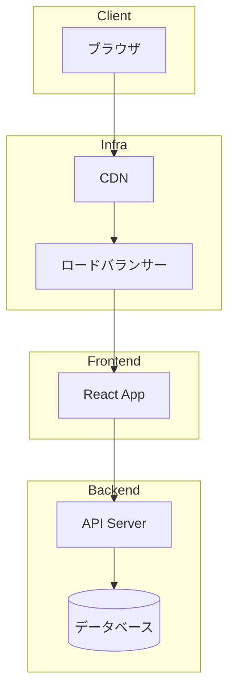
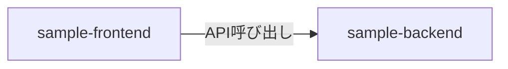

# アーキテクチャ

## システム構成図

## リポジトリ間の依存関係

## 技術スタック

### Frontend

| カテゴリ | 技術 |
|---|---|
| フレームワーク | React |
| 言語 | TypeScript |
| テスト | - |
| Lint | ESLint, Prettier |

### Backend

| カテゴリ | 技術 |
|---|---|
| ランタイム | Node.js |
| 言語 | TypeScript |
| データベース | - |
| テスト | - |

### Infrastructure

| カテゴリ | 技術 |
|---|---|
| クラウド | AWS |
| IaC | Terraform |
| CI/CD | GitHub Actions |

## 環境

| 環境 | 用途 | デプロイ |
|---|---|---|
| Development | ローカル | - |
| Staging | リリース前確認 | `main` マージ時 |
| Production | 本番 | Staging 確認後 |

> `-` の項目はプロジェクト開始時に決定してください。
