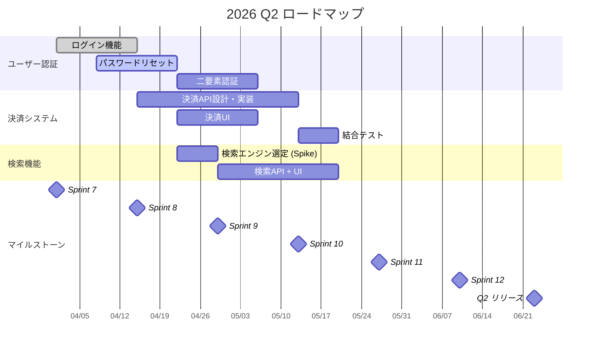
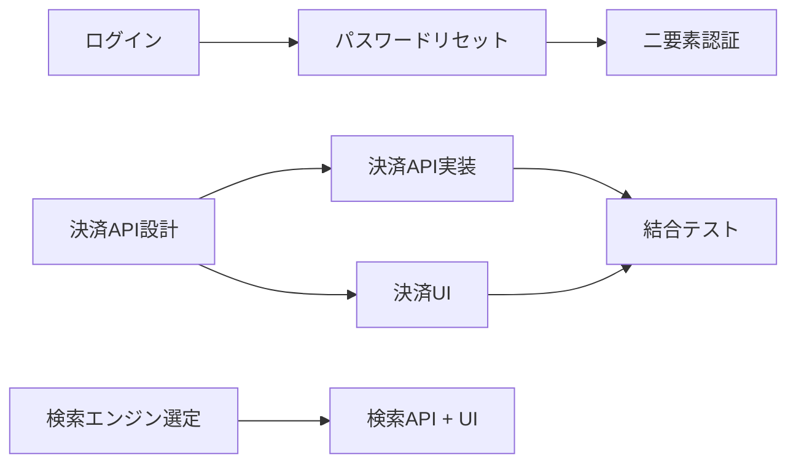

# ロードマップ 2026 Q2（4月〜6月）

## 全体タイムライン



## エピック一覧

| 優先度 | エピック | スプリント | ステータス |
|---|---|---|---|
| 🔴 High | ユーザー認証 | Sprint 7-9 | Not Started |
| 🟠 High | 決済システム | Sprint 8-11 | Not Started |
| 🟡 Medium | 検索機能 | Sprint 9-11 | Not Started |

## スプリント配分

| スプリント | 期間 | フォーカス |
|---|---|---|
| Sprint 7 | 04/01 〜 04/14 | 認証（ログイン） |
| Sprint 8 | 04/15 〜 04/28 | 認証（リセット・2FA）+ 決済設計 |
| Sprint 9 | 04/29 〜 05/12 | 決済実装 + 検索Spike |
| Sprint 10 | 05/13 〜 05/26 | 決済テスト + 検索実装 |
| Sprint 11 | 05/27 〜 06/09 | 検索最適化 + 結合テスト |
| Sprint 12 | 06/10 〜 06/23 | バグ修正 + リリース準備 |

## 依存関係



<details>
<summary>Mermaid ガントチャートの書き方</summary>

```
タスクA  :done,    id1, 2026-04-01, 2w     # 完了（グレー）
タスクB  :active,  id2, 2026-04-01, 2w     # 進行中（ハイライト）
タスクC  :crit,    id3, 2026-04-01, 2w     # クリティカル（赤）
タスクD  :         id4, after id1, 1w      # 依存（id1完了後に開始）
リリース :milestone, 2026-06-23, 0d         # マイルストーン
```

</details>
